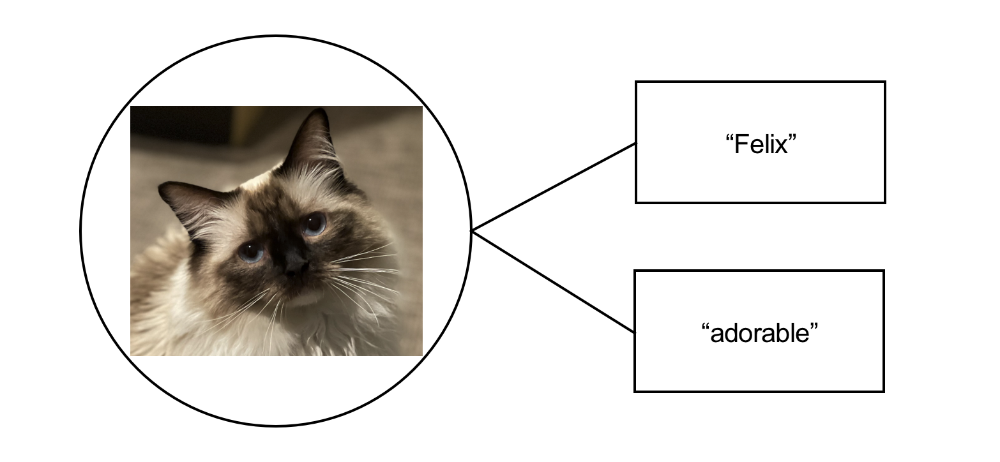
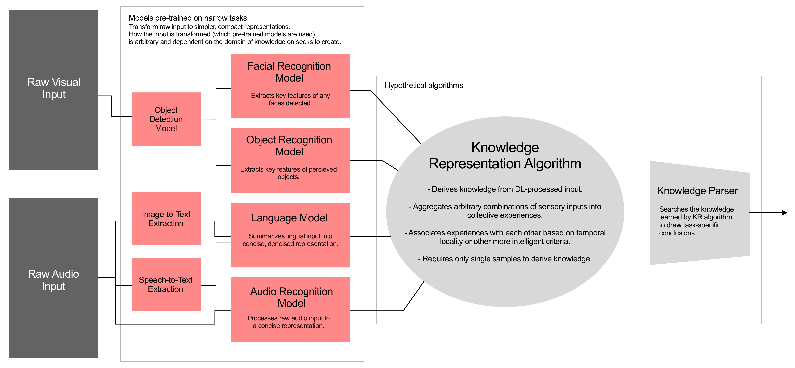
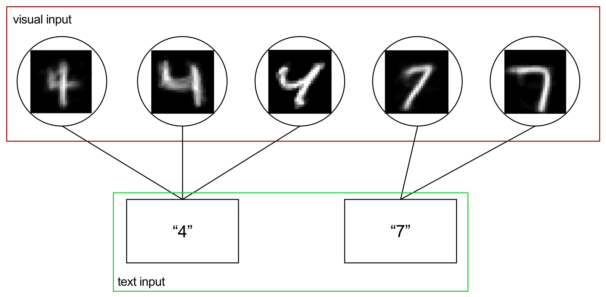
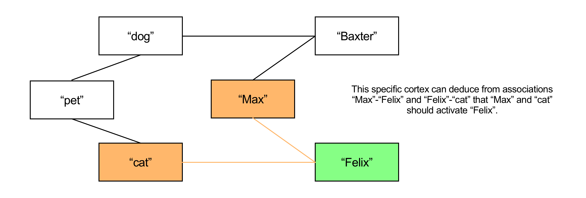

# A Naive Attempt at Deep Learning Augmented Knowledge Representation and Continuously Learning Agents

**Disclaimer: The ideas presented here are underdeveloped due to a lack of free time, but regardless it is a short read and some interesting results are achieved.**

## Motivation

Most AI practitioners agree that these are a few of the most pressing technical challenges to the field today:
1. State of the art (SOTA) AI models are only good at performing narrowly defined tasks i.e. recognize handwritten digits, recognize objects, generate art in this format/style, etc.
2. SOTA AI models are unable to generalize from the skills/knowledge they’ve acquired.
3. SOTA AI models learn very slowly, requiring thousands to millions of examples to perform tasks well.

This project is called “naive” because the ideas it takes stabs at all three of these fundamental problems, so expecting even partial success would indeed be naive. The ideas presented here were largely inspired by neuroscience material, specifically the Thousand Brains Theory of Intelligence by Jeff Hawkins.

## Key Ideas

### Key Idea 1
**It’s ok that Deep Learning takes forever if we can leverage its skills to augment faster-learning, more generalizable algorithms.**
Training a deep neural network via some form of gradient decent to perform a particular task is akin to evolving a particular organ via natural selection to perform a particular task, i.e. compare the evolution of the visual cortex to a machine that processes visual input from the eyes to the training a convolutional neural network to a function that processes visual input from an image or camera.

### Key Idea 2
**Deep Learning systems can learn to represent noisy sensory input as concise and not-noisy vectors, and simpler models can learn from these representations more effectively than the raw input.**
The jury is still out on the extent of the latter conclusion (see my repo titled “transfer-learning”), but the first half of the statement is certainly true.

### Key Idea 3
**A fundamental component of learning is simply associating sensory inputs with others.**
For example, associating the visual input of your mother’s face with the audible input “mom”. This feels intuitively true and is backed by neuroscience/psychology in some (likely much more complicated) form. This idea can also be extended explain to more complicated behavior without incredible stretches of the imagination, for example recognizing some noise made from one’s own mouth while playing with vocal chords with a noise heard from mom earlier while looking at her face. Perhaps such associations could be represented in a graph or something.

## The Framework
Using these ideas one might think for a while and come up with something like this:

Note that which Deep Learning models you include in such a framework is arbitrary and task-specific. If you only care that your final agent be able to associate simple labels with visual objects, one needn’t include audible input or the NLP algorithms. Another important note is that the outputs of these pre-trained models aren’t necessarily the probabilities that the input represents a particular label, but some intermediate representation learned while training for such a task. Ideally the knowledge representation algorithm can learn more generally from these representations.

## The Artificial Cortex
The Artificial Cortex is my initial attempt at filling the “Knowledge Representation Algorithm” bubble described above. The Artificial Cortex seeks to generate an undirected weighted graph where vertices represent some sensory input and the edges represent associations between these inputs. I’ve convinced myself that such graphs can be valuable if constructed properly. Here are a few simple examples of how such graphs could be valuable.

In this example, this cortex has two sensory inputs: a visual input of 28x28 images, and a textual input of simple strings. This cortex can be used to associate images of handwritten digits by feeding the cortex an input image, and returning which corresponding label is most strongly associated with the recognized image. This particular example is implemented in code and using this procedure without preprocessing the image data leads to 95% accuracy on the MNIST dataset.

This cortex might result from some simple preprocessing of text input statements like "Max owns Felix and Baxter", "Dogs and cats are pets", "Felix is a cat", "Baxter is a dog". It is easy to imagine simple algorithms that use text preprocessing along with this graph to answer questions like "Who owns Felix?", "What kind of pet is Baxter?", or even questions requiring simple logical deductions like "Who is Max's cat?". Such algorithms could borrow heavily from existing algorthims designed to extract information from Knowledge Graphs.

A large part of what makes these graphs valuable is that they are not bounded by an input-output space, so one could train a cortex to recognize handwritten digits, and then train the same cortex to recognize information about my pets, and then teach information at the intersection of each, resulting in a graph that can give insight into each topic.

## Cortex Implementation

The first iteration of the artificial cortex is contained in cortex.py. For some terminology, "cortex" refers to the graph of sensory associations and each node in the graph is referred to as a "column" (from "cortical column"). The parent class for the Column object has 3 core properties: 
- a sense-specific "reference" for determining whether the column recognizes a particular input
- a list of "connections" to other columns in the cortex (the edges in the graph), stored as (column, weight) tuples
- an "activation" scalar which assigns a value to how "active" the column is given a sensory input
  
This first iteration accepts two sensory inputs, visual and textual. These senses manifest themselves as specialized column objects for recognizing such inputs, specifically, the cortex is composed "vision columns" and "text columns". Visual inputs come in the form if 28x28 grayscale images of handwritten digits, text inputs are simply strings. The training procedure is conducted as follows:

1. Feed the cortex an input sample of an image and its corresponding label.
2. For each input (visual and text), 
   1. if some existing column in the cortex recognizes the input store it for the next step
   2. else create a new column with the input as its reference and store it for the next step.
3. Create a connection or strengthen the existing connection between the two columns stored in the previous step.

A helpful phrase to help the training procedure is the classic "neurons that fire together wire together" (replace "neuron" with "column" in this context). Obviously I'm neglecting to explain very specific implementation details, but such nuances can easily be found in the code if the general procedure is roughly understood. To test the cortex, testing samples are shown to the cortex and activations are propagated to adjacent columns. Then the cortex's columns are parsed for the most active text column. If the most active text column is the label of the test sample, the sample has been correctly classified.

This implementation achieves a respectable 95% accuracy on the MNIST dataset given 5000 training samples, and an underwhelming 82% accuracy on 5000 Fashion MNIST samples (trained on top of the existing cortex for classifying vanilla MNIST). Furthermore, by associating each label "0", "1", ... , "9" with another label "digit", and associating the Fashion MNIST labels with another label "fashion", the cortex can also distinguish between "digit" and "fashion" samples with >99.5% accuracy.

## Conclusion

The potential benefits of the cortex are not fully tested in this preliminary implementation, but it does show some motivating results performing benchmark classification tasks about as well as you would expect from a K-Nearest Neighor or K-Means Clustering algorithm i.e. it is indeed capable of learning useful patterns. Obvious next steps include testing the limits of more complex tasks like those that require some amount of reasoning like in the second example, as well as testing out augmenting feature-extracting pre-trained vision or language models in order to learn from messier or more complicated inputs.

